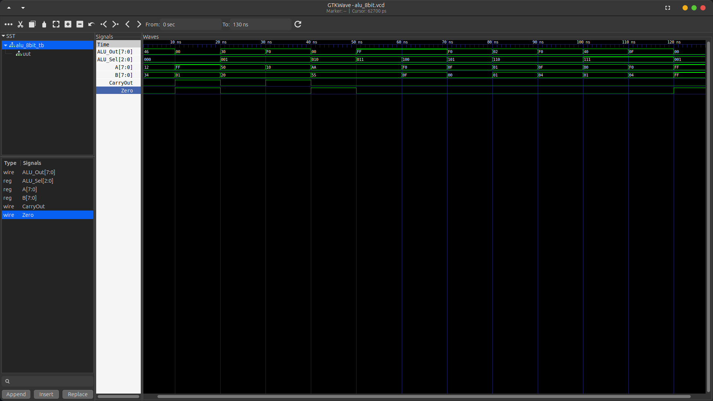

# 8-Bit Arithmetic Logic Unit (ALU) in Verilog HDL

**Name:** Manish Kr. Rajbanshi  
**Roll No:** 079BCT044  
**Department:** Electronics, Communication and Information Engineering (BEI)  
**Assignment:** FPGA Lab Assignment  

---

This repository contains a design and simulation of a simple 8-bit Arithmetic Logic Unit (ALU) implemented in Verilog HDL. The ALU performs 8 different operations selected by a 3-bit operation selector (`ALU_Sel`).

## ALU Architecture

### Ports Interface

| Port Name | Direction | Width | Description |
| :--- | :--- | :--- | :--- |
| `A` | Input | 8 bits | Operand A |
| `B` | Input | 8 bits | Operand B |
| `ALU_Sel` | Input | 3 bits | Operation selector |
| `ALU_Out` | Output | 8 bits | ALU result |
| `CarryOut` | Output | 1 bit | Carry out (addition) / Borrow out (subtraction) |
| `Zero` | Output | 1 bit | Zero flag (1 if `ALU_Out` is 0) |

### Operation Mapping (`ALU_Sel`)

| `ALU_Sel` | Operation | Description |
| :---: | :---: | :--- |
| `3'b000` | **ADD** | Addition (`ALU_Out = A + B`) |
| `3'b001` | **SUB** | Subtraction (`ALU_Out = A - B`) |
| `3'b010` | **AND** | Bitwise AND (`ALU_Out = A & B`) |
| `3'b011` | **OR** | Bitwise OR (`ALU_Out = A | B`) |
| `3'b100` | **XOR** | Bitwise XOR (`ALU_Out = A ^ B`) |
| `3'b101` | **NOT** | Bitwise NOT of A (`ALU_Out = ~A`) |
| `3'b110` | **SLL** | Shift Left Logical (`ALU_Out = A << B[2:0]`) |
| `3'b111` | **SRL** | Shift Right Logical (`ALU_Out = A >> B[2:0]`) |

---

## How to Run

To run the simulation, make sure you have [Icarus Verilog](http://iverilog.icarus.com/) and [vvp](https://linux.die.net/man/1/vvp) installed.

### 1. Compile the Design and Testbench
```bash
iverilog -o alu_test alu_8bit.v alu_8bit_tb.v
```

### 2. Run the Simulation
```bash
vvp alu_test
```

Running the simulation will output verification logs for all 8 operations and generate a Value Change Dump (VCD) file named `alu_8bit.vcd`.

### 3. View Waveforms
You can load the generated `alu_8bit.vcd` file into [GTKWave](https://gtkwave.github.io/gtkwave/) to visualize the waveforms.

---

## Simulation Waveform

Below is the waveform showing the simulation results for all test vectors:


